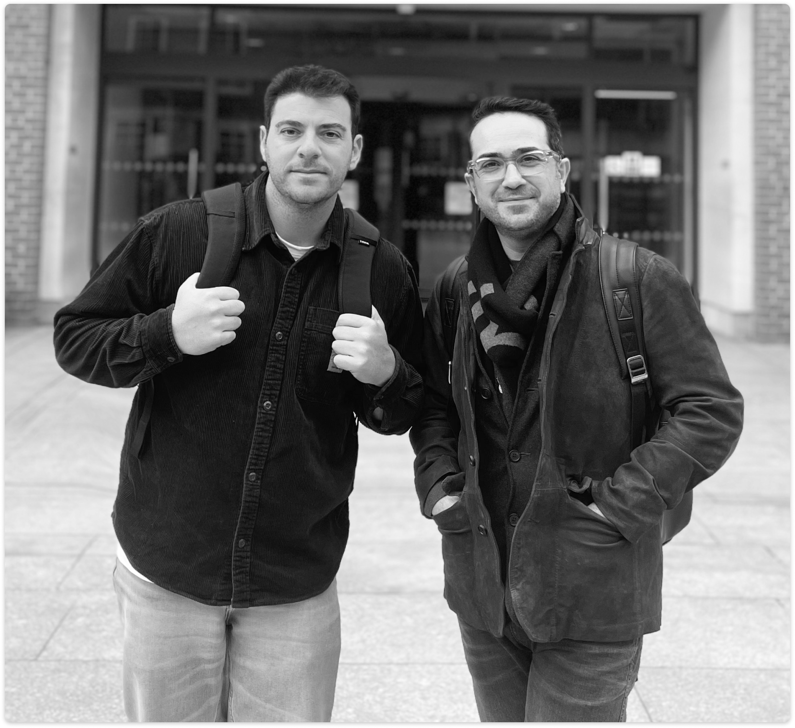
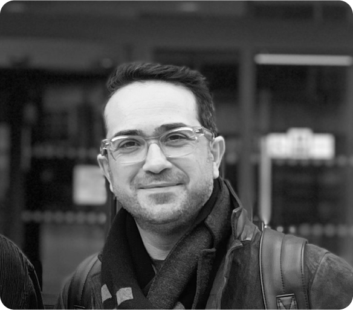
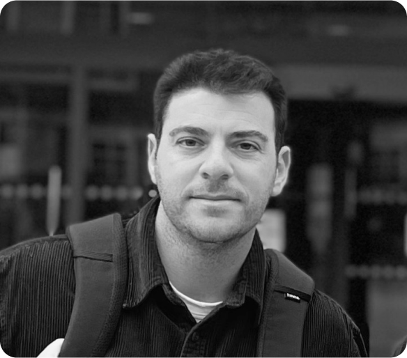

# Founding team

## How did we meet?

**:fontawesome-solid-server:  Hi! We are Dimitris (left) and Stelios (right), and we are computer systems guys!**

**We have been working together since 2014 and they are good friends.**

## What is our story?

Stelios was Dimitris' undergraduate thesis supervisor at the Technical University of Crete in Greece. Then, Dimitris was introduced to the area of distributed systems, while Stelios was a postdoctoral researcher. After completing his studies, Dimitris moved to London to study a PhD under Stelios' mentorship. It was during his doctoral research that the Warestack idea was born. Since January 2024 we are working towards the `one-click workflows for any codebase` solution!

!!! quote

    We are passionate about solving tech problerms of workflow operations (1) by making them faster, efficient and secure!
    { .annotate }
    
    1. Creation, execution and monitoring! 

    

## Why us?

| Skill      | Description                          |
| ----------- | ------------------------------------ |
| We have a solid long relationship       | Working together for 10+ years - constructive conflict. |
| Academic and tech proficiency       | Ph.Ds. in CS & deep tech domain knowledge. |
| Research impact    | Stelios 100+ publications / 2K+ [citations](https://scholar.google.com/citations?user=hLqLr1IAAAAJ&hl=en "Stelios Google Scholar profile")/ led >$1M R&D projects. |
| Industrial experience in the area   | Both worked on DevOps/Workflow in B2B since 2019. |
| Startup leading experience (Stelios) | Stelios served as the CTO at Chimnie and other projects, including Huawei, Autodesk, IBM, and others.  |
| Startup leading experience (Dimitris) | Dimitris demonstrated leadership in development at Chimnie, alongside expertise in infrastructure at Quine.  |

## Stelios Sotiriadis `CEO`

<a href="https://www.linkedin.com/in/stelios-sotiriadis-b9a1a571/" target="_blank">LinkedIn</a>

Stelios is a co-founder, director and CEO of Warestack. He is also an assistant Professor of Computer Science at Birkbeck, University of London. 

He holds a BSc, MSc, and Ph.D. in computer science. Since 2018, he has been an assistant Professor at Birkbeck, University of London. In the past, he worked as a postdoctoral fellow at the University of Toronto, where he collaborated with companies such as IBM, Autodesk, Huawei, and other Toronto-based startups.

???+ Quote end "Short CV"
    Stelios is an active researcher (H-index 26) in performance modelling and scaling of cloud-native applications. He is an ex-Chimnie CTO and he already led >$1M R&D projects in the area of distributed systems and cloud computing. He enjoys driving his classic Mini Cooper and watching football.

## Dimitris Kargatzis `CTO`

<a href="https://www.linkedin.com/in/dimitris-kargatzis/" target="_blank">LinkedIn</a>

Dimitris is a co-founder, director and CTO of Warestack. He is also a visiting lecturer on computer science at Birkbeck, University of London. 

With a strong background in software engineering, Dimitris is a seasoned software and systems engineer who specializes in DevOps and infrastructure design. He holds a BSc in Electrical & Computer Engineering from the Technical University of Crete and is actively engaged in PhD research at Birkbeck University of London. 

???+ Quote end "Short CV"
    Dimitris currently leads the creation and maintenance of cloud infrastructure on AWS and GCP, employing Infrastructure as Code (IaC) tools like Terraform. He also excels in implementing CI/CD workflows, ensuring seamless deployments on EKS and GKE platforms. Passionate about knowledge-sharing, Dimitris is committed to fostering collaboration within the tech community.
