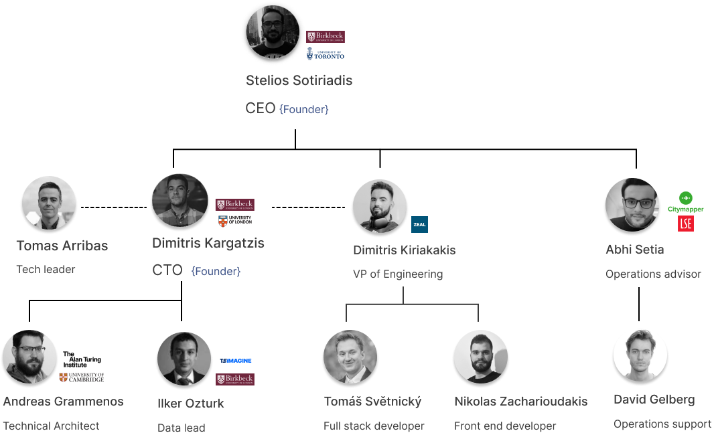

# Team

A team with a strong technological and operational background.

## Team hierarchy

## Core team members

### <a href="https://www.linkedin.com/in/kiriakakis/" target="_blank"> Dimitris Kiriakakis</a>
`VP of Engineering`: Dimitris is a full stack developer with 10+ years of working experience in 
different sorts of frontend & backend frameworks.

### <a href="https://linkedin.com/in/abhis23" target="_blank"> Abhi Setia</a>
`Operations advisor`: Abhi is a seasoned operator with 7 years of experience across early-growth stage tech companies.
Currently, he is the Chief Operating Officer at Quine, a venture-backed deep-tech startup leveraging Machine Learning to quantify the experience of software developers and match them to fractional and full-time work opportunities Previously, he was part of the founding team at Cosmos Video (backed by LocalGlobe), and held a cross-functional role across business/product streams at Citymapper (backed by Index, Balderton). He began my career with ~ 2 years in tech investments (capital, debt) and hold an Applied Mathematics Degree (scholarship recipient) from the London School of Economics. He already raised $4M in his previous projects.

### <a href="https://www.linkedin.com/in/iozturk/" target="_blank"> Ilker Ozturk</a>
`Data & AI lead`: Ilker has 10+ years of experiences in complex data modelling problems. He has extensive experience in data strategies and he is an analytics expert with 2 exits.

### <a href="https://www.turing.ac.uk/people/former-doctoral-students/andreas-grammenos" target="_blank"> Andreas Grammenos</a>
`Technical Advisor`: Andreas completed his PhD from Cambridge University and he has over 1K citations. He is currently CTO @ Quine and worked with the Alan Turing institute. He already raised $5.5M in his previous projects.

### <a href="https://www.linkedin.com/in/tomups" target="_blank"> Tomas Arribas</a>
`Technical Lead`: Tomas is a tech expert with a deep understanding of software development across the whole stack, cloud technologies, DevOps practices and AI. He currently leads the tech team at Chimnie, setting our technical direction and supporting our teams in data, development, and operations to work as one. But I still enjoy getting my hands dirty with coding and problem-solving. 
He has solid history of crafting software and systems, being part of a digital agency for more than 12 years, where he worked on projects for big names like Google, Toyota, YouTube, Sony or Armani, meeting the needs of large clients and pushing the envelope in tech under the spotlight of global giants. He have also founded two startups, learning firsthand what it takes to turn an idea into a product that people use and love (and how hard it really is!).

