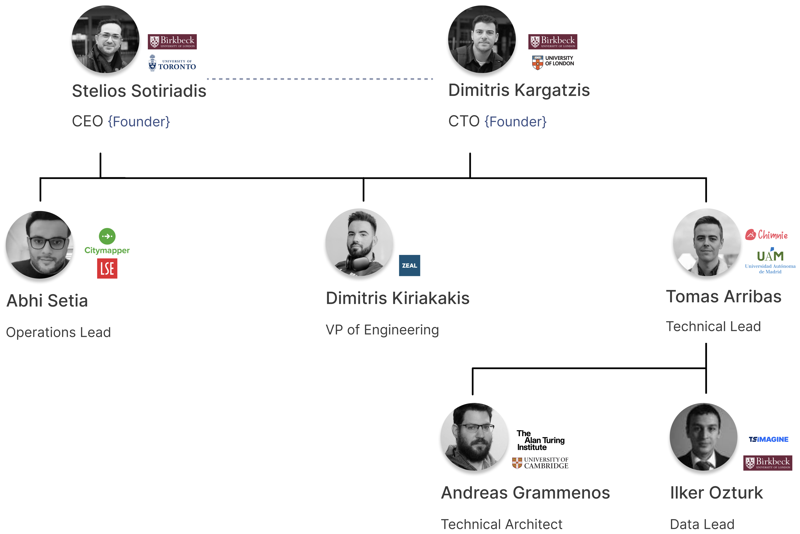

# Team

A team with a strong technological and operational background.

## Team hierarchy

???+ Tip end "Core team members hierarchy"
    

## :fontawesome-solid-people-group: Core team members

### [Abhi Setia](https://linkedin.com/in/abhis23 "Visit Linkedin"){:target="_blank"} `Operations Lead`

Abhi brings seven years of expertise in early to growth-stage technology companies, serving as our operations and strategic planning leader. His seasoned background in operations positions him as a pivotal figure in guiding our direction and strategy. He already raised $4M in his previous projects. He is working towards Warestack's product-market fit.

??? Quote end "Short CV"
    He began his career with ~ 2 years in tech investments (capital, debt) and holds an Applied Mathematics Degree (scholarship recipient) from the London School of Economics.
    
    Currently, he is the Chief Operating Officer at Quine. Previously, he was part of the founding team at Cosmos Video (backed by LocalGlobe), and held a cross-functional role across business/product streams at Citymapper (backed by Index, Balderton). 

    [Crunchbase profile](https://www.crunchbase.com/person/abhi-setia "Visit crunchbase"){:target="_blank"}

### [Dimitris Kiriakakis](https://www.linkedin.com/in/kiriakakis/ "Visit Linkedin"){:target="_blank"} `VP of Engineering`

Dimitris is a fullstack developer leading software development and project management tasks. He has 10+ years of working experience in companies and startups around the world. 

??? Quote end "Short CV"
    He holds a BSc in Computer Engineering (Technical University of Crete, class of 2013) and in the past he has been part of various product teams as developer and consultant.

    Some of the languages and frameworks he has hands-on experience with are NodeJS, Spring Boot, Java, Kotlin, Typescript, Angular, VueJS, React and more recently GoLang and NextJS. In his free time you will find him sweating in a crossfit studio or riding his skis on a mountain slope.

###  [Tomas Arribas](https://www.linkedin.com/in/tomups "Visit Linkedin"){:target="_blank"} `Technical Lead`

Tomas is a tech expert with a deep understanding of software development across the whole stack, cloud technologies, DevOps practices and AI. He is leading workflow engineering and AI related tasks.

??? Quote end "Short CV"
    He currently leads the tech team at Chimnie. Tomas has an Msc in Computer Science from UAM and solid history of crafting software and systems. He is being part of a digital agency for more than 12 years, where he worked on projects for Google, Toyota, YouTube, Sony or Armani, meeting the needs of large clients and pushing the envelope in tech under the spotlight of global giants. 
    
    He have also founded two startups, learning firsthand what it takes to turn an idea into a product that people use and love (and how hard it really is!).

### [Andreas Grammenos](https://www.turing.ac.uk/people/former-doctoral-students/andreas-grammenos "Visit profile"){:target="_blank"} `Technical Advisor`

Andreas completed his PhD from Cambridge University and he has over 1K citations. He is supporting the deep tech side and he already raised $5.5M in his previous projects.

??? Quote end "Short CV"
    Andreas was born in Athens, in the late 80’s and formally obtained his Degree in Electronic & Computer Engineering from Technical University of Crete in 2015. He joined University of Cambridge in October 2016. 
    
    Since 2021 he is the CTO at Quine and researcher at the Alan Turing institute. 

### [Ilker Ozturk](https://www.linkedin.com/in/iozturk/ "Visit Linkedin"){:target="_blank"} `Data & AI Lead`

Ilker boasts over a decade of expertise in tackling intricate data modeling challenges. He possesses profound knowledge in data strategy development and is an accomplished analytics specialist with two successful exits to his credit. He is leading data science tasks with a particular focus on the LLM side.

??? Quote end "Short CV"
    Ilker presently serves as the Global Head of Data Science and Engineering at TS Imagine. He holds a Bachelor of Arts from Galatasaray University and a Master of Science in Data Science from Birkbeck, University of London.