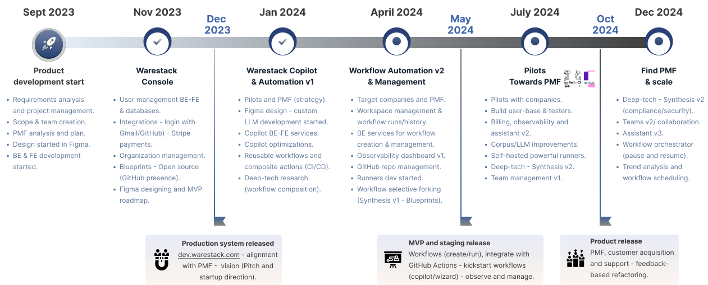
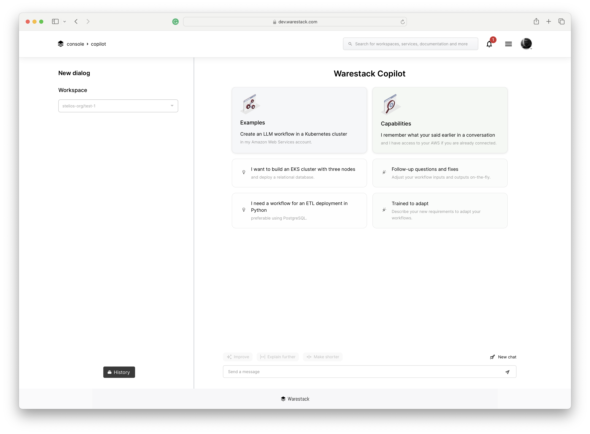
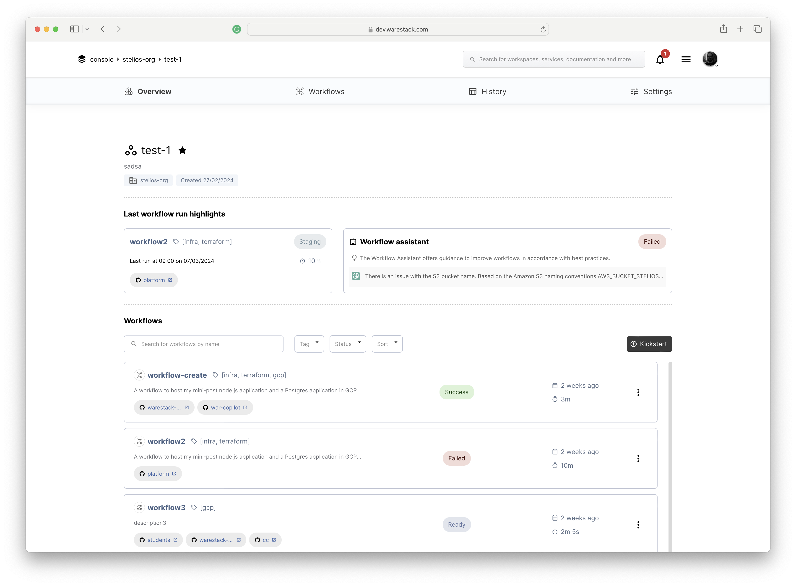

# Product development

## Product information

The product roadmap presents the development journey of Warestack, from its initial conception through to our launch date and into the future.

???+ Quote end "Roadmap"
    

## Pilots and use cases

We have already secured letters of intent from GoCharlie and Renovai to participate as pilot users to test and improve our product.

  <a href="https://gocharlie.ai/" class="card" >   
GoCharlie is a leading Generative AI company specializing in developing cognitive agents and models optimized for businesses.
</a>

  <a href="https://gocharlie.ai/" class="card" >  
 Renovai is spearheading Visual AI Design be providing multiple commerce solutions, including the first ever AI powered Stylist, visual.
</a>

## Product screens

Discover our latest product developments through our UI designs on Figma.

:fontawesome-solid-circle-arrow-right: [User interface designs on Figma](https://www.figma.com/file/zsn3MfTd3oBo16XYYwWEXJ/web-app-v3?type=design&node-id=53-2634&mode=design "Visit our public Figma space"){:target="_blank"}

## Warestack development environment

Explore our development environment.

:fontawesome-solid-envelope: Please create an account and email us at `admin@warestack.com` to request console access.

:fontawesome-solid-circle-arrow-right: [https://dev.warestack.com](https://dev.warestack.com "Visit the development environment"){:target="_blank"}

=== "Development environment"

    Screenshot showing Warestack's console entrance (post-login).

    </a>

=== "Copilot"

    Screenshot showing Warestack's prototype copilot.

    

=== "Workspace"

    Screenshot showing Warestack's prototype workspaces.

    </a>

## Warestack backend documentation

Explore our user experience designs in Figma that showcase current product developments.

:fontawesome-solid-circle-arrow-right: [Warestack REST API documentation](https://api.warestack.com/v1/docs/index.html "Visit Warestack's Swagger documentation"){:target="_blank"}

## Warestack GitHub presense

Explore our GitHub public repositories including blueprints, CI/CD workflows and other codebases.

:fontawesome-solid-circle-arrow-right: [Warestack at GitHub](https://github.com/warestack "Visit our GitHub space"){:target="_blank"}

