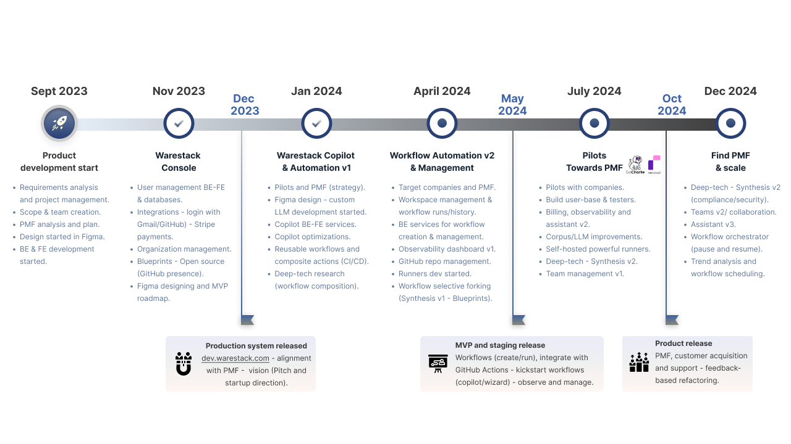
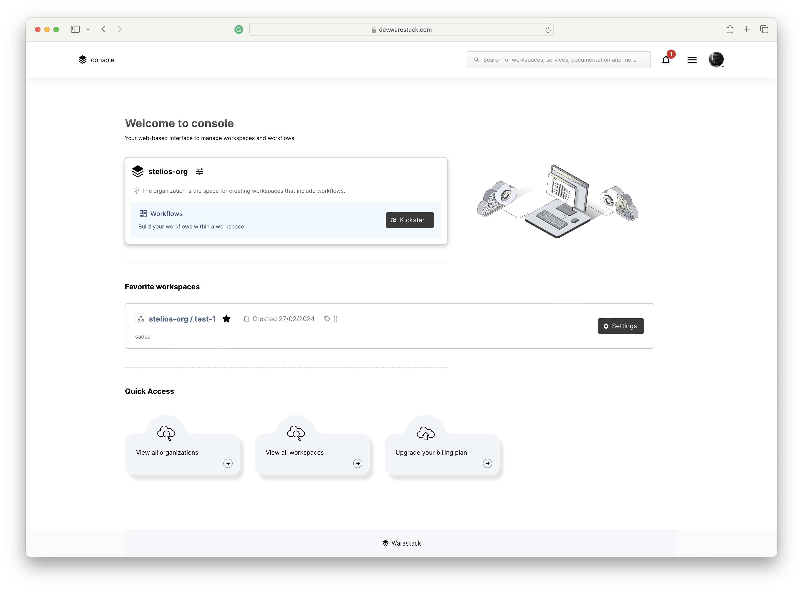
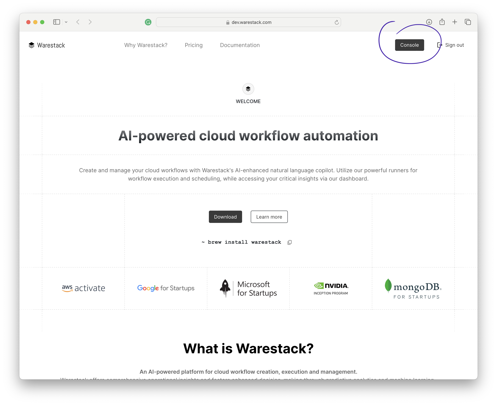
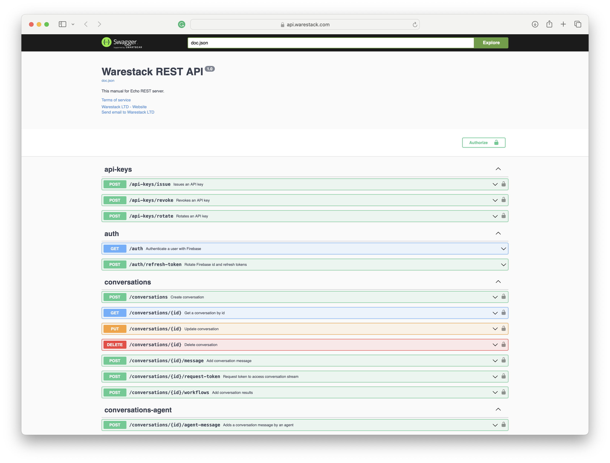

# Product overview

## Product roadmap

The product roadmap showcases our journey of development starting from the inception of Warestack.
???+ Info
    

## Product screens in Figma

Explore our user experience designs in Figma that showcase current product developments.

<a href="https://www.figma.com/file/zsn3MfTd3oBo16XYYwWEXJ/web-app-v3?type=design&node-id=53-2634&mode=design" target="_blank"> :fontawesome-solid-circle-arrow-right:  Figma designs `web-app_v3/console_share`

</a>

## Warestack <a href="https://dev.warestack.com" target="_blank">development environment</a>

Explore our current development environment.

<a href="https://dev.warestack.com" target="_blank"> :fontawesome-solid-circle-arrow-right: https://dev.warestack.com

</a>

:fontawesome-solid-envelope: Please create an account and email us at `admin@warestack.com` to request access.

## Warestack backend documentation (Swagger)

Explore our user experience designs in Figma that showcase current product developments.

<a href="https://api.warestack.com/v1/docs/index.html" target="_blank"> :fontawesome-solid-circle-arrow-right: Warestack REST API

</a>

## Warestack GitHub presense

Explore our GitHub public repositories including blueprints, CI/CD workflows and other codebases.

<a href="https://github.com/warestack" target="_blank"> :fontawesome-solid-circle-arrow-right: Warestack at GitHub</a>

