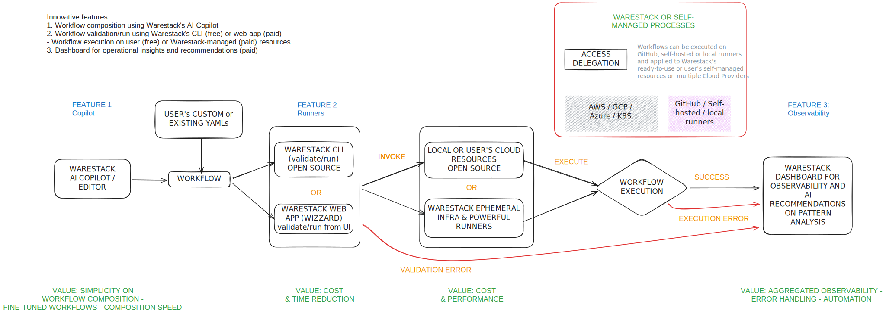

# Tech and Community

## Architecture

> <a href="https://excalidraw.com/#room=cbe9ad7e3782f2d4aadf,9BBCJcrK9sjLaqtQNm_Cdw
" target="_blank"> Link to a technical view of our product (excalidraw). </a>

## What does the community say?

* <a href="https://twitter.com/mitchellh/status/1731071326201561194?s=46&t=WgmgJJS9NisHL6I8Oqg4_A" target="_blank"> *I'm surprised no one has built a niche business around self-hosted GitHub Actions runners...* Post by Mithcell Hashimoto</a>

* <a href="https://survey.stackoverflow.co/2022" target="_blank">*CI/CD and DevOps are top categories...yet, only 37% of responders have access to the necessary observability tools.* Stack Overflow survey</a>

