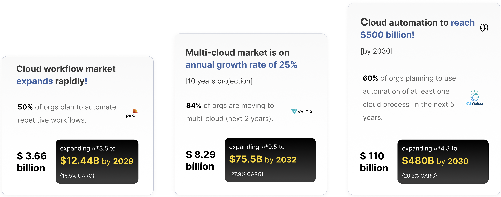

# Welcome

Welcome to [Warestack](https://www.warestack.com "Visit console page") data room. In this space you can find useful information about our product, team, and financial plan.

:fontawesome-solid-envelope: Feel free to get in touch for more information.
```
admin@warestack.com
```

## What is a Warestack workflow?

A workflow in Warestack’s context is an automated process that simplifies tasks in cloud computing and software development. 

> It handles the orchestration of cloud resources and integration with providers (like `Amazon Web Services` or the `Google Cloud Platform`) by utilizing code and repositories with actions (like `GitHub Action`), deploying and configuring systems (like `databases`), and setting up their dependencies.

:bulb: Workflows are specified in YAML files and can be triggered by events like push actions, pull requests, issue creations, or manually. They can also be scheduled to run at specific times.

### :fontawesome-solid-square-xmark: What are the problems?

1. High complexity: Worfklow creation and management requires a ton of integrations with manual hardcoded configurations. (1) 
    { .annotate }
    
    1. It's like learning a new language in every step of the workflow.
    
2. Indefficient operations: Error resolution requires billable time, plus high tech expertise is needed to setup. (1) 
    { .annotate }
    
    1. It's like taking a cab without knowing the fare.

3. Hard to observe and fix: Jumping from workflow to workflow to debug, then go to Google or Stack Overflow to ask for help. (1) 
    { .annotate }
    
    1. It's like looking for a needle in a big haystack.

### :fontawesome-solid-square-check:  What is our solution?

We solve the workflow operation puzzle! Setting up workflows is complex and costly. We simplify and reduce costs by providing workflow compositions and self-hosted solutions with observability. Our solution includes:

1. Low-code copilot: We provide a custom LLM to help you compose and optimize workflows in minutes. (1)
 { .annotate }
    
    1. Like using ChatGPT but to describe needs and build workflows.

2. Self-managed runners: Self and cloud hosted workfklow runners to control cost, performance and compliance. (1)
 { .annotate }
    
    1. Like taking an Uber instead of the bus.
    
3. Holistic observability: A unique dashboard to manage, fix and operate multi-cloud wofklows.(1)
 { .annotate }
    1. Like taking an Uber instead of the bus.

### :fontawesome-solid-thumbs-up: Is there a market?



???+ Quote end "Looking for more?"

    Explore our :paperclip: [elevator or extended pitches](1_pitch.md) for more information.

### :fontawesome-solid-cloud: Memberships

We are members of startup programs. (1)
{ .annotate }

1.  :man_raising_hand: They offer technical support, guidance, and access to credits for resources worth up to $200,000.


